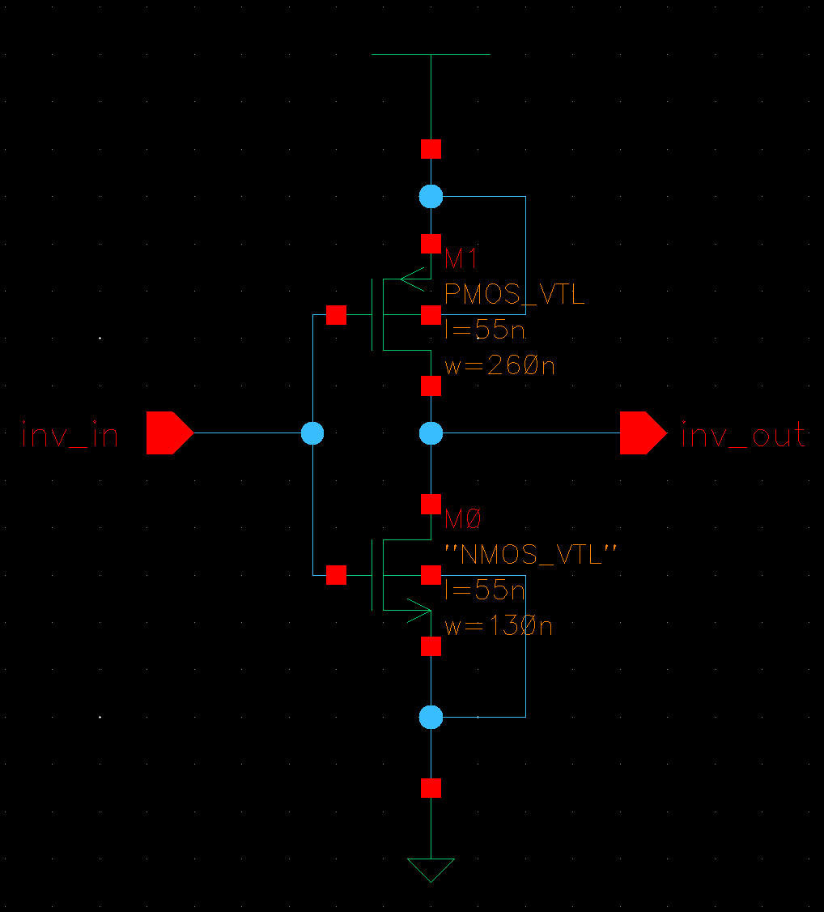
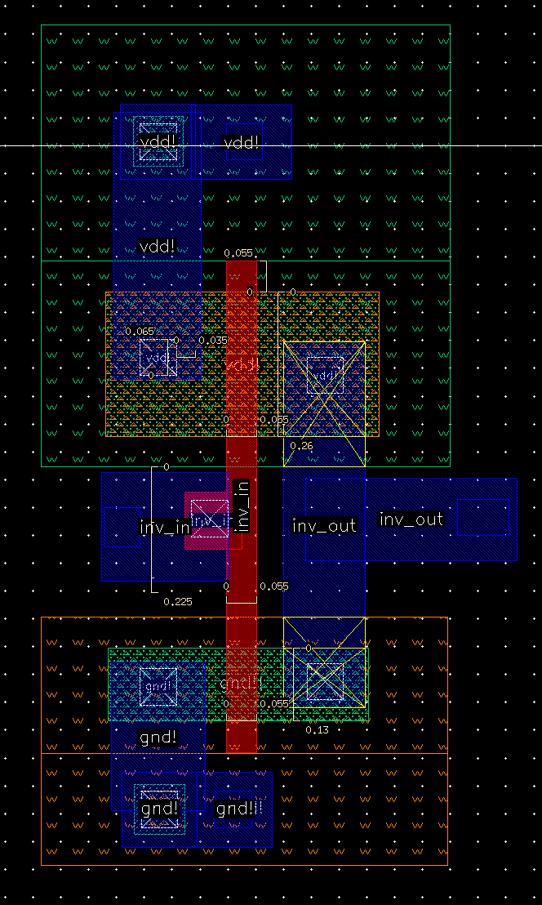
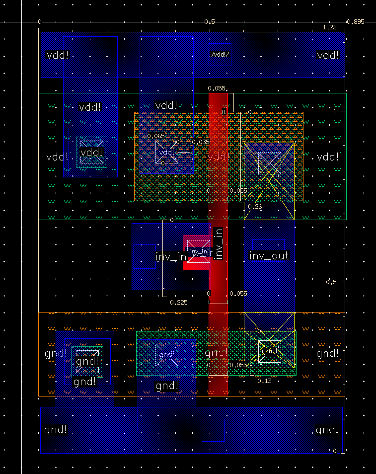

# VLSI-Design-Labs

Currently working on custom IC designs, including schematic, logic/analog simulation, layout, verification, and post-layout simulation.

## Tools

**EDA Tools**: Cadence Virtuoso (schematic/layout), NC Verilog (logic sim), Spectre (analog sim), Calibre (DRC/LVS/Parasitic Extraction), HSPICE (post-layout sim)

**Technology**: FreePDK45 (45nm CMOS)

## Lab 0 - Inverter (Completed)

- Basic inverter design (schematic & layout)
- Logic and analog simulation
- Physical verification (DRC/LVS)
- Parasitic extraction and post-layout simulation

<table>
  <tr>
    <td align="center">
      <strong>Inverter Schematic</strong> 
      
    </td>
    <td align="center">
      <strong>Initial Layout (DRC/LVS Passed)</strong> 
      
    </td>
    <td align="center">
      <strong>Cleaner Layout 2</strong> 
      
    </td>
  </tr>
</table>

## Lab 1 - 4-Bit SRAM Memory Cell (Completed)
*Will post images when class is done submitting lab, or reach out on LinkedIn for more details!*

**Part A: 4-bit Memory Cell**

- Inverter characterization across input slews and output load capacitances (HSPICE)
- 4-bit latch-based memory array with area optimization
- Logical/physical verification (Spectre/HSPICE)

**Part B: 32x32 Memory Array**

- Simulate and measure worst-case access time (Spectre)
- Wire delay modeling/simulation using RC networks
