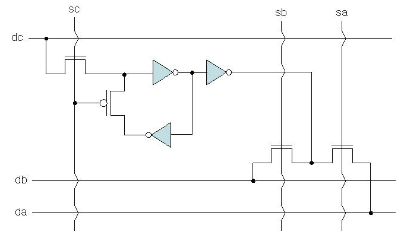
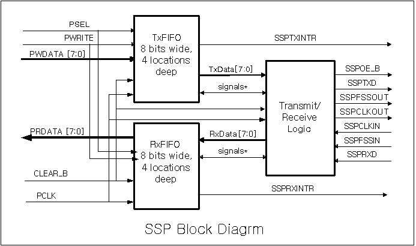
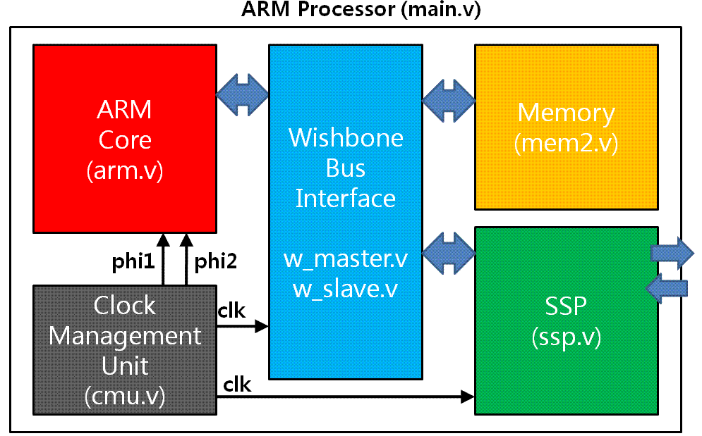
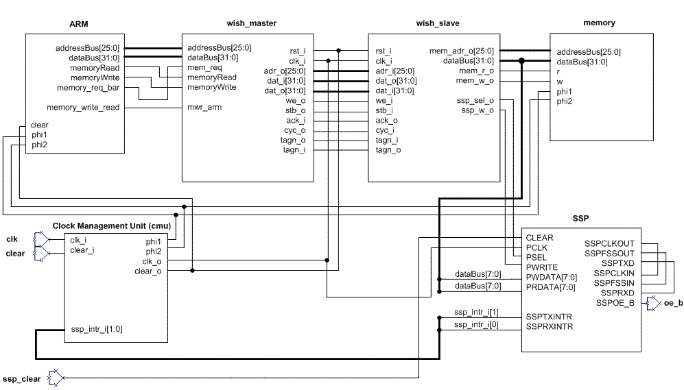

# VLSI-Design-Labs

Currently working on schematics/layouts for VLSI IC designs, including logic simulation, verification, custom layout/APR, and post-layout simulation.

## Tools

**EDA Tools**: Cadence Virtuoso (schematic/layout), NC Verilog (logic sim), Spectre (analog sim), Calibre (DRC/LVS/Parasitic Extraction), HSPICE (post-layout sim), PrimeTime (static timing analysis), Design Vision (synthesis), Innovus (automatic place-and-route)

**Technology**: FreePDK45 (45nm CMOS)

## Lab 0 - Inverter

- Basic inverter design (schematic & layout)
- Logic and analog simulation
- Physical verification (DRC/LVS)
- Parasitic extraction and post-layout simulation

<table>
  <tr>
    <td align="center">
      <strong>Inverter Schematic</strong> 
      
    </td>
    <td align="center">
      <strong>Initial Layout (DRC/LVS Passed)</strong> 
      
    </td>
    <td align="center">
      <strong>Cleaner Layout 2</strong> 
      
    </td>
  </tr>
</table>

*For the following, reach out on LinkedIn for more details or images!*

## Lab 1 - 4-Bit SRAM Memory Cell

**Part A: 4-Bit Memory Cell**

- Inverter characterization across input slews and output load capacitances (HSPICE)
- 4-bit latch-based memory array with area optimization
- Logical/physical verification (Spectre/HSPICE)

**Part B: 32x32 Memory Array**

- Simulate and measure worst-case access time (Spectre)
- Wire delay modeling/simulation using RC networks

## Lab 2 - 16-Bit Adder and ALU (Completed)

**Part A: 16-Bit Adder**

- Created schematic for 16-bit adder with signed/unsigned add, sub, overflow bit, and increment/decrement
- Verified full functionality with NC Verilog test cases and waveform analysis
- Analyzed static timing delays with PrimeTime, optimizing for delay - including a Kogge-Stone adder, efficient set/clearing for increment/decrement, optimized decoder for control signals, FO4 buffers to reduce fanout delays, and buffers to isolate branching non-critical paths

**Part B: 16-Bit ALU**

- Designed ALU schematic to perform logic (OR, XOR, NOT, AND), compare, arithmetic (from previous adder), and shift operations
- Verified full functionality, with emphasis on correct logic vs arithmetic vs rotate shifting as well as arithmetic shifting overflow
- Optimized funnel shifter to minimize delay - reduce large fanout, place faster control signals on delay path before slower ones, ensure overflow bit from shifter utilizes the least amount of gates and logic levels possible
- Also optimized for the final critical path delay through the adder to compare operation 

## Lab 3 - Synchronous Serial Port (SSP) and Wishbone Bus Interface

**Part A: SSP Design**

- Implemented module for 8-bit parallel-to-serial/serial-to-parallel logic in SystemVerilog
- Included 4-deep FIFO for Transmit (TX) and Receive (RX) to buffer data when crossing clock domains (CDC)
- Verified functionality using VCS, validating frame control signals and ensuring correct data loopback behavior
- Synthesized using Design Vision, optimizing constraints to balance area/timing and no negative slack

**Part B: Integration of SSP with ARM Core using Wishbone**

- Designed Wishbone Bus interface with Master/Slave modules to bridge 32-bit ARM processor with SSP and memory
- Implemented memory-mapped I/O logic for instruction memory (0x0000000-0x000FFFF) and SSP data transfer (0x0010000 for write, 0x0010001 for read)
- Created Clock Management Unit (CMU) to generate non-overlapping two-phase clocks (phi1/phi2) and stalling of ARM core during TX FIFO overflow
- Verified system-level integration in VCS with ARM assembly test program
- Synthesized with Design Vision and also took through APR (Innovus) for floorplanning, layout, and routing

